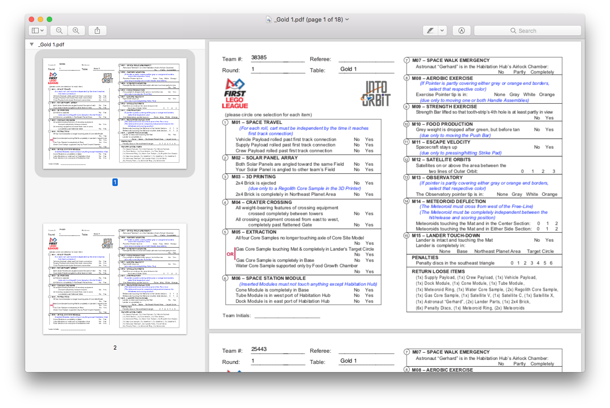

# FLL Tournament Score Sheet Filler

Originally written for the East Tennessee regional championship (48 teams, 8 tables) so that referees don't have to fill out a table number, team, and round number on each of 18 sheets.
Helps with legibility, keeps the old-fashioned paper trail in case there's questions from the scorekeepers.

Also fills out team numbers for your Core Values, Robot Design, and Innovation Project judging rooms.

Also makes a Word document to print and include in each team's folder or bag, with the team's schedule for the day laid out legibly, including QR codes for each scheduled event.

Yeah, it's grown a bit since the original version.

# Requirements

Python 3, plus the following modules:

- Pandas
- Reportlab
- pdfrw
- docx
- qrcode
- icalendar
- uuid

Developed on Python 3.7, Pandas 0.24.1, ReportLab 3.5.13, pdfrw 0.4

# Instructions

## CSV of teams' tournament schedule

Have a CSV of teams' robot game schedule saved in the current directory.

The CSV should be literally comma-separated, with columns of:

- Pit Assignment
- Team Number
- Team Name
- Time for Innovation Project Judging
- Location for Innovation Project Judging
- Time for Robot Design Judging
- Location for Robot Design Judging
- Time for Core Values Judging
- Location for Core Values Judging
- Time for Practice Round(s) (optional)
- Table for Practice Round(s) (optional)
- Time for Robot Game Round 1
- Table for Robot Game Round 1
- Time for Robot Game Round 2
- Table for Robot Game Round 2
- Time for Robot Game Round 3
- Table for Robot Game Round 3

The order of these columns must match the `column_types` definition in the main `fll-generate-sheets.py` script.

The reference CSV used was copied from an Excel spreadsheet used to make a printed team schedule.
The `TimeX` columns were originally in Excel time format, and ended up expressed as floating point numbers between 0 and 1 indicating the time of day.
That makes it easier to sort times to figure out which table has a given team's round 1, 2, or 3.

## Robot Game score sheet template

Have a template score sheet (PDF format) saved in the current directory.

## Judging Rubric template

Have a judging rubric sheet (PDF format) saved in the current directory.
It's assumed this PDF will have:

- Core Values rubric on page 1
- Innovation Project rubric on page 2
- Robot Design rubric on page 3

## Team schedule template

Hav a team schedule (.docx format) saved in the current directory. It's assumed that you'll have:

- a first paragraph placeholder that will be replaced with "Welcome, Team N (Team Name)!" (where N and Team Name are replaced with the team's actual number and name)
- a second paragraph placeholder that will be replaced with "Your Pit Assignemnt: Pit N" (where N is replaced with the team's actual pit assignment)
- a table representing your pit layout as the first table in the document, with greyed-out pit numbers in the appropriate cells. The team's pit number will be bolded and blackened.
- an optional table with two rows, a placeholder for the team's practice round schedule
- a table with 2 rows and 3 columns, a placeholder for the team's robot game schedule
- a table with 2 rows and 3 columns, a placeholder for the team's Innovation Project, Robot Design, and Core Values schedule

Each of the scheduling tables will get QR codes on row 1, and text of the places and times on row 2.

Do whatever you want after the judging table: a map of the surrounding area, suggestions for lunch, other notes or announcements, etc.

## Usage

    ./fll-generate-sheets.py schedule.csv robot-game-template.pdf rubric.pdf team-template.docx YYYY-MM-DD

where the file parameters are detailed above, and the last parameter represents the date of the tournament (so the QR codes will get the correct dates).

# Results

For a tournament with N teams, M Robot Game tables, L Innovation Project rooms, K Robot Design rooms, J Core Values rooms, the script will create:

- M Robot Game PDF files, each with 3*N/M pages
- L Innovation Project PDF files, each with N/L pages
- K Robot Design PDF files, each with N/K pages
- J Core Values PDF files, each with N/J pages
- N Team Schedule handouts
